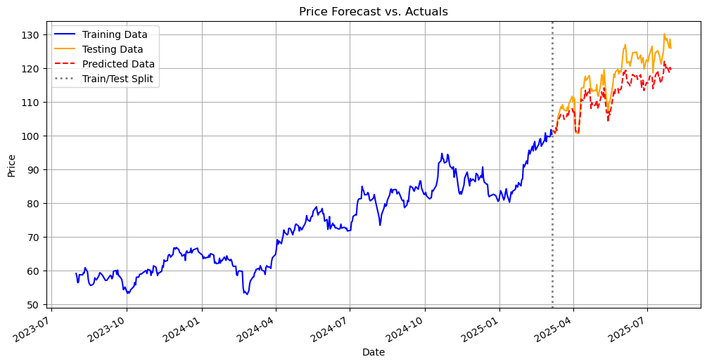

# Customer segmentation analysis using K-Means clustering
<!-- TABLE OF CONTENTS -->

## Table of Contents

- [Overview](#overview)
- [Tools](#tools)
- [Contact](#contact)

<!-- OVERVIEW -->

## Overview

This project focuses on **WPM stock price forecasting** through time series analysis. It includes **data cleaning**, **stationarity checks** (differencing non-stationary series), and **Granger Causality analysis** to find predictive relationships.

Three models were applied: **ARIMA**, **ARIMAX**, and **VAR**. The **VAR model, utilizing differenced stationary data, delivered superior performance** with a Mean Absolute Percentage Error (MAPE) of 1.05% for price prediction. Key libraries used include Pandas, Matplotlib, and Statsmodels.

## Tools

- [Pandas](https://pandas.pydata.org)
- [Numpy](https://numpy.org)
- [Matplotlib](https://matplotlib.org)
- [Seaborn](https://seaborn.pydata.org)
- [Statsmodels](https://www.statsmodels.org/stable/index.html)
- [Scikit-learn](https://scikit-learn.org/stable/)

## Contact

- GitHub [@Sotun-1010](https://github.com/Sotun-1010)
- Twitter [@O_G_Sotun](https://twitter.com/O_G_Sotun?t=kRiO1YNhYKn8NJJnxTZ42A&s=03)
- Portfolio Site [Ogunjirin Oluwasotun](https://www.datascienceportfol.io/oluwasotunogunjirind)
- Medium [Ogunjirin Oluwasotun Goodness](https://medium.com/@oluwasotunogunjirin)
- Website [Oglytics](https://oglytics.webflow.io/)
